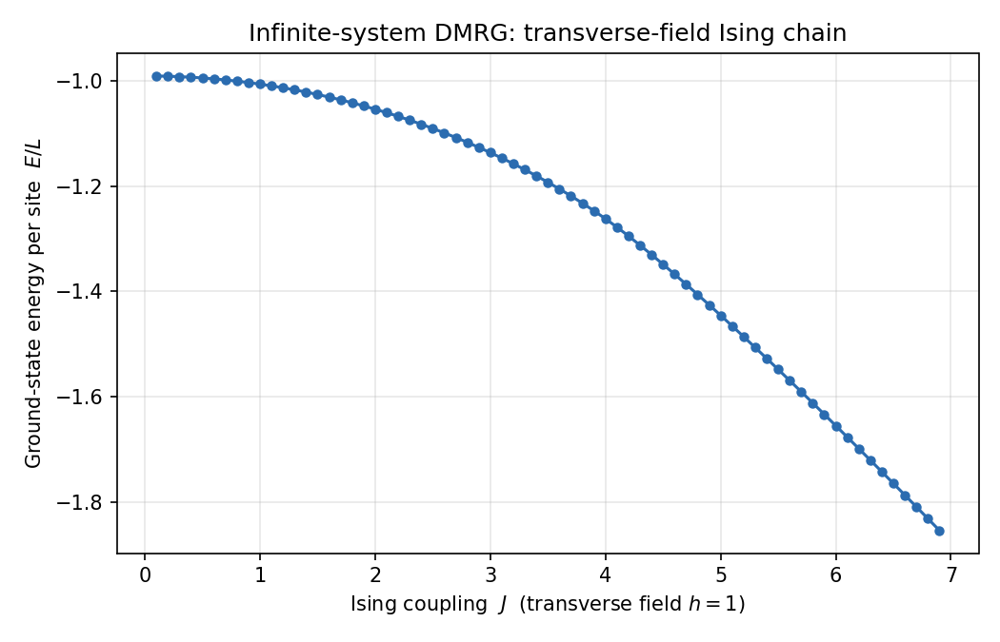

# DMRG for the Transverse-Field Ising Chain

A compact, readable implementation of the **density-matrix renormalization
group (DMRG)** applied to the one-dimensional spin-$\frac12$ **transverse-field
Ising model**. DMRG is the workhorse method for ground states of 1D quantum
lattice systems: it grows the chain one site at a time and, at each step, keeps
only the few most important states of the reduced density matrix, capturing the
dominant entanglement while keeping the effective Hilbert space small. The result
is near-exact ground-state energies at a tiny fraction of the cost of exact
diagonalization.

## Model

Spin-$\frac12$ transverse-field Ising chain,

$$
H = J \sum_{\langle i,j\rangle} S^{z}_i S^{z}_j \;+\; h \sum_i S^{x}_i ,
$$

with Ising coupling $J$ and transverse field $h$. Varying the ratio $h/J$ drives
the chain through a quantum phase transition between an ordered (ferromagnetic)
and a disordered (paramagnetic) ground state.

## What's here

| File | Purpose |
|------|---------|
| `ising_infinite.py` | Infinite-system DMRG engine + the Ising model. Grows a symmetric chain and returns the bulk energy per site. |
| `ising_infinite_sweep.py` | Scans the Ising coupling $J$ at fixed field and records the ground-state energy per site. |
| `ising_finite.py` | Finite-system DMRG: sweeps back and forth across a fixed-length chain to variationally refine the ground state. |
| `plot_energy.py` | Plots the coupling sweep. |
| `data/energy_vs_coupling.dat` | Output of the sweep ($J$ vs $E/L$). |
| `figures/energy_vs_coupling.png` | The plot below. |

## Results

Ground-state energy per site $E/L$ as the Ising coupling $J$ is swept at fixed
transverse field $h = 1$ (infinite-system algorithm, chain length $L = 100$,
bond dimension $m = 20$):



## Running it

Requires Python 3 with `numpy`, `scipy`, and `matplotlib`:

```bash
pip install numpy scipy matplotlib

python3 ising_infinite.py          # single infinite-system run
python3 ising_infinite_sweep.py    # sweep J, write data/energy_vs_coupling.dat
python3 plot_energy.py             # render figures/energy_vs_coupling.png
python3 ising_finite.py            # finite-system algorithm with sweeps
```

## Method notes

The **infinite-system algorithm** builds the chain by repeatedly enlarging a
block by one site and using its mirror image as the environment, giving a good
estimate of the bulk energy per site. The **finite-system algorithm** then fixes
the chain length $L$ and sweeps one block across the other, using previously
stored blocks as the environment; raising the number of kept states $m$ on
successive sweeps systematically drives down the truncation error
$\varepsilon = 1 - \sum_{i=1}^{m} w_i$, where $w_i$ are the leading eigenvalues of
the reduced density matrix. The ground state of each superblock is found with a
Lanczos solver (`scipy.sparse.linalg.eigsh`).

## Credits

The DMRG engine is adapted from the excellent pedagogical
[**simple-dmrg**](https://github.com/simple-dmrg/simple-dmrg) code by
James R. Garrison and Ryan V. Mishmash (MIT license). The model-specific parts —
the transverse-field Ising Hamiltonian and the parameter studies here — are my
own. Distributed under the MIT license (see `LICENSE`).
